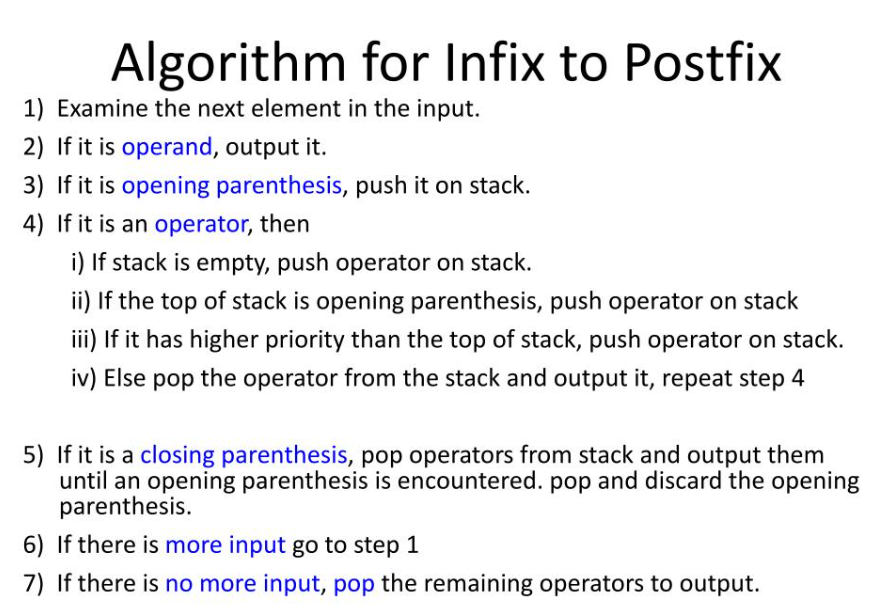

# Wildcard Project

You have a cool idea for an algorithms project? Use this repository. Make sure
to explain what problem you're solving, how you're doing it, and that you test
your code.

In computer organization we went over the algorithm used to convert infix equations to postfix equations. Seeing a simple algorithm "in the wild" inspired me to apply what I've learned in this class to write a function that applies the practical algorithm learned in that class to convert infix equations to postfix equations. This is certainly not the most complex program, but it has been commented over to explain in detail how the function works. Below I will attach the algorithm from my organization course that I used as psuedocode for my algorithm.

Minor help with specific lines and syntax from chatGPT. All lines are commented accordingly.

I certify that I have listed all sources used to complete this exercise, including the use of any Large Language Models. All of the work is my own, except where stated otherwise. I am aware that plagiarism carries severe penalties and that if plagiarism is suspected, charges may be filed against me without prior notice.
